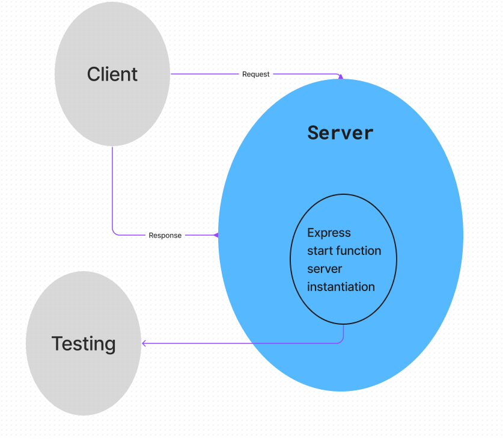

# LAB 01  

## Project: server-deployment-practice  

### Author: Justin Mathieu  

## Problem Domain  

ci/cd deployment practice with basic server.  

## Links and Resources  

[GitHub Actions ci/cd](https://github.com/Justin-Mathieu/server-deployment-practice/actions)  
[back-end dev server url](https://server-deployment-dev.onrender.com)  
[back-end prod server url](https://server-deployment-prod-1cnq.onrender.com)  

## Collaborators

401d53 and 401d10  
Used demo code as permitted.  

Setup  

- port variable  

How to initialize/run your application (where applicable)  

- Clone repo  
- Run npm i in terminal  
- Run nodemon in terminal  

## Routes  

- GET : /endpoint - specific route to hit  

## Tests  

- Run the command npm test with dsependencies installed.  

## UML  

